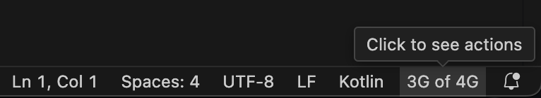
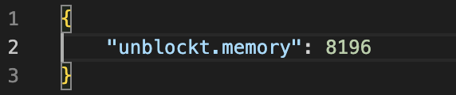
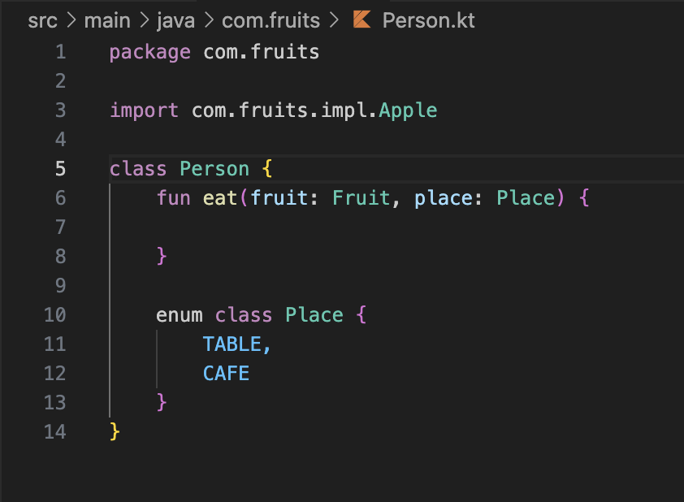
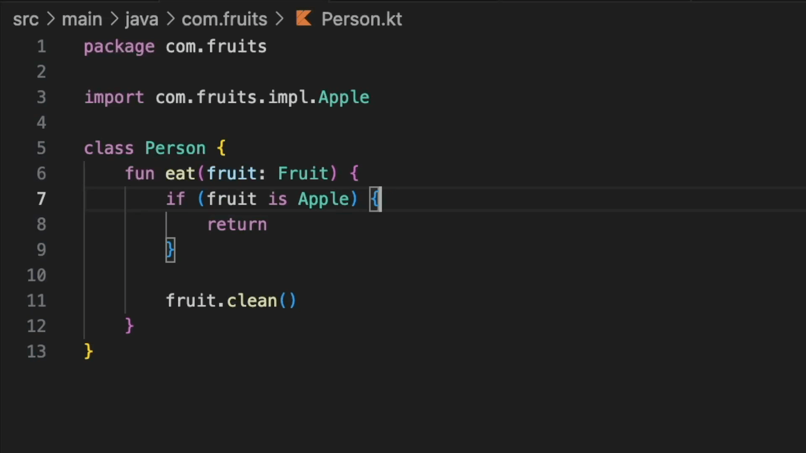

<picture style="float: left;">
  <source width="64" height="64" media="(prefers-color-scheme: dark)" srcset="images/logo/whiteLogo.png">
  <source width="64" height="64" media="(prefers-color-scheme: light)" srcset="images/logo/blackLogo.png">
  
</picture> 

# Unblockt

### Kotlin language support for Visual Studio Code
This repository is made to provide documentation and collect feedback. Use GitHub Issues to report any feedback.

**Extension currently is in a very early stage**. It's very appreciated if you report all issues you experience if any.
## Installation
1. Install the `Unblockt` extension from Visual Studio Code Marketplace
2. Open any `.kt` or `.kts` file to activate the extension

Once extension is activated, it'll perform several steps:
 - Launch language server
 - Read project structure using Gradle
 - Index project files to provide code-insight features

After indexes are built, extension is ready to use.

## Basics
- Extension provides a widget in the bottom right corner which shows actual memory usage:

- To view available `Unblockt` actions, press the widget: it'll open list of actions at the top.

## Requirements
- Java
- 4G of memory minimum, 8G recommended

## Settings
- Memory: configures heap size for language server in megabytes. Requires restart.

## Features
- Semantic highlighting

- Code completion

- Go to definition

## Actions
- `Reload Gradle project`
  - Reads actual project structure using Gradle and applies all the changes
- `Rebuild Indexes`
  - Deletes current indexes and builds them from scratch

## Limitations
- Only Gradle project structure is supported
- Only standard Gradle files layout is supported
- Only Kotlin JVM target is supported
- Code insight features for Gradle scripts are not supported

## Roadmap
The roadmap depends on the feedback.  
Currently, the plan is to support at first:
- Find usages
- Rename refactoring
- Kotlin Multiplatform

## Open source software used
- [Kotlin](https://github.com/JetBrains/kotlin)
- [IntelliJ IDEA Community Edition](https://github.com/JetBrains/intellij-community)
- [Caffeine](https://github.com/ben-manes/caffeine)
- [DefinitelyTyped](https://github.com/DefinitelyTyped/DefinitelyTyped)
- [esbuild](https://github.com/evanw/esbuild)
- [Gradle Tooling](https://github.com/gradle/gradle)
- [Log4j2](https://github.com/apache/logging-log4j2)
- [Sqlite JDBC](https://github.com/xerial/sqlite-jdbc)
- [System Stubs](https://github.com/webcompere/system-stubs)
- [vscode-languageserver-node](https://github.com/Microsoft/vscode-languageserver-node)